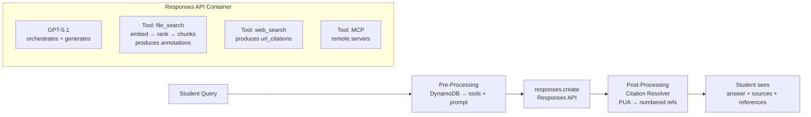
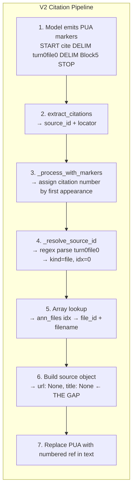
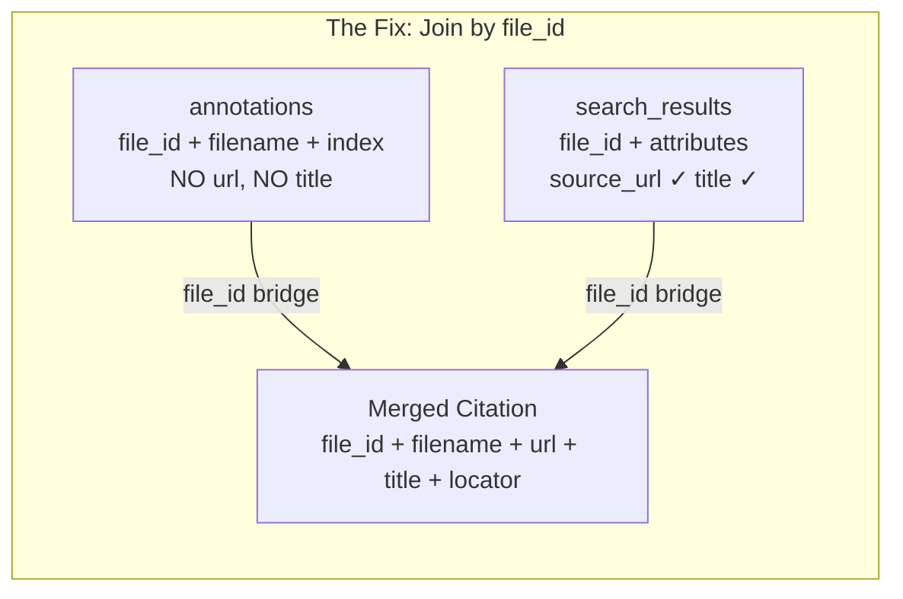

# Query-to-Citation Pipeline: Deep Dive

How a student's question becomes a cited response in harvard-ea, and where the gaps are.

> **Visual companion:** For architecture diagrams and step-by-step visuals, see [`/architecture_and_citations.html`](/architecture_and_citations.html)

---

## TL;DR

- **harvard-ea uses the Responses API** (stateless, assembled per-request), not the OpenAI Agents SDK — despite calling everything an "agent"
- **file_search is a server-side pipeline** (embedding → keyword search → ranker → vector store → tool logic) that produces two independent citation outputs: **annotations[]** (tool infrastructure) and **PUA markers** (model-generated, V2 only)
- **The gap:** annotations have `file_id` but no `url`; attributes have `source_url` but aren't in annotations. Citations can't link back to source pages.
- **The fix (~15 lines):** Add `include=["file_search_call.results"]` to `responses.create()`, join search_results to annotations by `file_id` → populate `url`. Zero extra API calls.
- **Blocking question:** S3 FileSync requires IAM credentials — can Ventz provide an alternative integration point?

---

## Action Items (for Ventz)

- [ ] **Confirm `include` returns attributes** — verify with our vector store that `search_results[].attributes` contains custom fields
- [ ] **Agree on custom attributes** — can we add `source_url`, `domain`, `title` in `sync_engine.py`? Or separate PR needed?
- [ ] **S3 auth path** — IAM role setup, or alternative integration point that avoids key/secret?
- [ ] **~15 line PR** — add `include` param + join in `_resolve_source_id()`. Can we submit this?
- [ ] **Manifest in prompt** — acceptable to add ~200 tokens (filename→URL mapping) as a stopgap?

---

## Architecture Overview







---

## 1. Responses API (Not the Agents SDK)

harvard-ea calls everything an "agent" — routes, configs, DynamoDB lookups, API headers all use `agent_id`. But it's **not** using the OpenAI Agents SDK.

| | Agents SDK | Responses API (what we use) |
|---|---|---|
| Object | Persistent `Agent` object with ID | Stateless — assembled per request |
| State | SDK manages conversation, tools, memory | You manage everything (DynamoDB + code) |
| Call | `agent.run()` | `client.responses.create()` |
| Config | Stored in OpenAI | Stored in DynamoDB, rebuilt each call |

An "agent" in harvard-ea is a DynamoDB record that stores: system prompt, model name, vector store ID, tool flags. Each request reads that config and assembles a `responses.create()` call from scratch.

**Code:** `chat_send_message.py:909-919`
```python
response_params = {
    "model": actual_model,
    "input": chat_input,
    "instructions": prompt,
    "tools": tools,
    "conversation": convo_id,
    "store": True,
}
response = client.responses.create(**response_params)
```

---

## 2. Tool Taxonomy

OpenAI's Responses API supports 9 tool types. They fall into 3 execution categories:

### Hosted (Server-Side)
OpenAI executes these internally. One API call — results injected into model context automatically.
- **file_search** — vector store RAG retrieval
- **web_search** — live web search
- **code_interpreter** — Python sandbox, reads full files

### Function Calling (Multi-Round)
You define functions. Model requests a call. Your code executes it. You send the result back. Model continues.
- Requires multiple round-trips
- You control execution entirely

### MCP (Remote)
Model calls a remote tool server via the Model Context Protocol.
- External servers (Slack, APIs, databases)
- Server handles execution

**APO Bot uses file_search only** — a hosted tool. The platform never sees raw chunks.

**Code:** `chat_send_message.py:798-883` (tool construction)

---

## 3. Query Flow

When a student asks a question:

```
1. Request arrives with Agent-ID header
2. config = get_configuration(agent_id)          ← DynamoDB lookup
3. Build tools: [{type: "file_search", vector_store_ids: [vs_id], max_num_results: 20}]
4. Append V2 citation instructions to prompt (if CITATIONS_V2=1)
5. client.responses.create(model, input, instructions, tools, conversation)
6. OpenAI internally: model calls file_search → vector store → chunks → model generates
7. Platform receives complete response with annotations
```

### What's in `response.output[]`

The response contains multiple output items:

```
response.output = [
    {
        type: "file_search_call",
        id: "fs_67c09...",
        status: "completed",
        queries: ["What is..."],
        search_results: null          ← null by default
    },
    {
        type: "message",
        content: [{
            text: "The answer is...",
            annotations: [
                {type: "file_citation", file_id: "file-abc", filename: "advising.txt", index: 42}
            ]
        }]
    }
]
```

---

## 4. file_search Internals

file_search is not a single model — it's a pipeline of specialized components:

| Component | Type | What it does |
|---|---|---|
| **GPT-5.1** | Generative LLM | Decides to search, reads results, writes answer + PUA markers |
| **Embedding model** | Non-generative | Converts query → vector (one-way math, no reasoning) |
| **Keyword search** | Sparse retrieval | BM25-style textual overlap matching |
| **Ranker** | Scoring model | Fuses semantic + keyword via reciprocal rank fusion, applies score threshold |
| **Vector store** | Database | Stores chunk vectors, executes cosine similarity |
| **file_search tool logic** | Infrastructure | Tracks chunk usage, builds `annotations[]` array |

The full sequence inside a single `responses.create()` call:
```
1. GPT-5.1 reads prompt + decides to search
2. Embedding model: query → vector
3. Vector store: cosine similarity + keyword search (hybrid)
4. Ranker: fuse results, apply score_threshold, produce top-N
5. Inject top chunks into GPT-5.1's context (as turn0file0, turn0file1...)
6. GPT-5.1 generates answer (+ PUA markers if V2 citation prompt active)
7. file_search tool logic: observe model's chunk usage → build annotations[]
```

The platform never intercepts or enriches chunks between the vector store and the model. By the time the model sees chunks, it's too late to inject metadata.

### Two separate citation creators within one call:

- **annotations[] (tool logic creates):** file_search infrastructure tracks which chunks the model drew from. Produces `{file_id, filename, index, type}`. No LLM involved — bookkeeping.
- **PUA markers (model creates):** GPT-5.1, taught by the citation prompt, explicitly writes invisible markers signaling what it's citing with locator precision. Only active when V2 prompt is appended.

V2 joins both: model's PUA markers (what was cited) + tool's annotations (file_id mapping).
V1 uses only annotations.

### What the model receives per chunk:
1. **Reference ID:** `turn0file0`, `turn0file1`, ...
2. **Filename:** Whatever the file is named in the vector store
3. **Chunk text:** The actual content (including [Block] markers if V2 preprocess is on)

### What the model does NOT receive:
- File attributes (not passed by file_search)
- Other chunks from the same file
- Source URL (unless embedded in chunk text)
- Full file context

---

## 5. What Comes Back Natively: Annotations

Annotations are attached to the response text by OpenAI. The schema is **fixed — 4 fields only:**

### AnnotationFileCitation
```python
class AnnotationFileCitation:
    file_id: str              # "file-abc123"
    filename: str             # "advising.txt"
    index: int                # character position in text
    type: Literal["file_citation"]
```

**No url. No title. No attributes. No custom fields. This cannot be extended.**

### AnnotationURLCitation (for comparison)
```python
class AnnotationURLCitation:
    url: str                  # "https://..."
    title: str                # "Page Title"
    start_index: int
    end_index: int
    type: Literal["url_citation"]
```

URL citations (from web_search) DO have url and title. File citations don't.

---

## 6. What Comes Back with `include`: Search Results

Pass `include=["file_search_call.results"]` to `responses.create()`. This populates the `search_results` field on the file_search_call output item:

```json
{
    "type": "file_search_call",
    "search_results": [
        {
            "file_id": "file-abc123",
            "filename": "advising.txt",
            "score": 0.92,
            "attributes": {
                "source_url": "https://german.fas.harvard.edu/advising",
                "domain": "german.fas.harvard.edu",
                "title": "Advising | Department of Germanic Languages"
            },
            "content": [{"type": "text", "text": "chunk content..."}]
        }
    ]
}
```

**Key:** These are the chunks that were retrieved — not the entire file. But `attributes` are per-file, so every chunk from that file carries the same attributes including `source_url`.

**Not used by harvard-ea today.** Adding it is the fix path.

Docs: https://developers.openai.com/api/docs/guides/tools-file-search

---

## 7. V2 Citation Pipeline

When `CITATIONS_V2=1`, the system does:

### At prompt time:
`build_citation_instructions()` appends PUA marker instructions to the system prompt. This teaches the model to emit invisible unicode markers after each cited claim:

```
Format: [CITATION_START]cite[DELIMITER]turn0file0[DELIMITER]Block5[CITATION_STOP]
```

Where CITATION_START, DELIMITER, STOP are private-use-area unicode characters (invisible in display).

### At response time (post-processor):

**Step 1: extract_citations()** (`citations.py:129-167`)
- Regex finds all PUA marker spans in the text
- Parses each into: `{source_id: "turn0file0", locator: "Block5"}`

**Step 2: _process_with_markers()** (`citations.py:325-373`)
- Assigns citation numbers by first appearance: `pair_to_num = {}; next_num = 1`
- First unique (source_id, locator) pair gets [1], next gets [2], etc.
- Replaces PUA spans with `[N]` in the cleaned text

**Step 3: _resolve_source_id()** (`citations.py:486-539`)
- Parses "turn0file0": regex → kind="file", idx=0
- Array index lookup: `ann_files[0]` → retrieves the annotation at that index
- Returns: `{source_type: "file", file_id, filename, url: None, title: None, quote}`

**The gap is in Step 3:** `url` and `title` are hardcoded to `None` because annotations only have 4 fields.

### Code flow:
```
citations.py:51-53   → PUA constants defined
citations.py:73-74   → _SOURCE_ID_TURN_RE regex
citations.py:129-167 → extract_citations()
citations.py:325-373 → _process_with_markers()
citations.py:486-539 → _resolve_source_id()
```

---

## 8. V1 Fallback (What Runs Today)

When `CITATIONS_V2` is off (the default), the V1 path runs:

1. Model writes plain text (no PUA markers — no citation prompt appended)
2. OpenAI attaches `file_citation` annotations with character positions
3. Post-processor reads annotations, groups by unique filename
4. Assigns `*[N]*` markers by first-appearance order
5. Returns `[{file_id, filename}]` — no url, no locator, no quote

**Code:** `chat_send_message.py:225-310` (V1 logic)

---

## 9. Sources Panel vs References Section

These are **two completely separate citation systems** that run in parallel:

### Sources Panel (Code-Driven)
- Built by the post-processor (V1 or V2)
- Input: resolved citations with file_id, filename, locator, url
- Frontend renders: numbered circles + filename + block badge + clickable url
- `[1]` in text links to `[1]` in Sources panel

### References Section (Model-Driven)
- Written by the model based on agent system prompt instructions
- Appears as `### References` in the message body — it's just text
- Model writes whatever it can see: URL (if in chunk), title, quote
- No programmatic connection to Sources panel

**The model's `*[1]*` markers and the Sources panel `[1]` are NOT the same system.** They happen to look similar when both are active.

---

## 10. The Gap & Fix Paths

### The Core Problem
- Annotations have `file_id` but no `url`
- Attributes have `source_url` but aren't in annotations
- The post-processor has file_id but can't get url from it without extra work

### Fix Path A: `include` Parameter + Join (RECOMMENDED)
1. Add `include=["file_search_call.results"]` to `responses.create()`
2. Extract search_results from the file_search_call output item
3. In `_resolve_source_id()`, join by file_id: look up the file in search_results, grab `attributes["source_url"]`
4. Populate `url` and `title` fields instead of None

**Zero extra API calls.** Data already in the response — just need to wire the join.

Requires: `source_url` set as a custom attribute at upload time.

### Fix Path B: Separate API Call
- After resolving citations, call `client.vector_stores.files.retrieve(vs_id, file_id)` per unique file
- Get `.attributes["source_url"]` from the response
- Downside: N extra API calls per response (one per cited file)

### Fix Path C: Manifest in Prompt
- Bake filename-to-URL mapping from manifest.json into the system prompt
- Model always has the mapping, can write URLs in References section
- Trade-off: ~200 extra prompt tokens for 61 files
- Only helps model-written References, not the Sources panel

### Fix Path D: Code Interpreter (Full File Access)
- Add code_interpreter tool alongside file_search
- Model can read entire files including headers
- Solves a different problem (full document access, not per-citation URL)
- Overkill for citation URLs specifically

---

## 11. Open Questions for Ventz

1. **Does `include` return attributes in search_results?** Docs say yes — need to verify with our vector store.
2. **Response size increase:** Does `include` add significant payload? (chunk content is already processed by the model, this just makes it visible to our code too)
3. **Setting custom attributes:** Can we add `source_url`, `domain`, `title` to the attribute dict in `sync_engine.py:351-368`? Or does this need a separate PR/discussion?
4. **S3 auth for FileSync:** Currently requires AWS access key + secret. Can Ventz provide an alternative integration point that avoids IAM setup? (e.g., pre-signed URLs, platform upload API, shared bucket with cross-account access already configured). If IAM is required: who creates the role, what permissions scope, how are credentials rotated?
5. **Code interpreter relevance:** Any use cases where students need full-document answers (summaries, table extraction) that file_search chunks can't serve?
6. **Manifest in prompt approach:** Is it acceptable to add ~200 tokens to every prompt for the filename→URL mapping? Trade-off vs platform code change.

---

## Documentation Links

- [Tools Overview](https://developers.openai.com/api/docs/guides/tools)
- [File Search](https://developers.openai.com/api/docs/guides/tools-file-search)
- [Retrieval / Search Results Schema](https://developers.openai.com/api/docs/guides/retrieval)
